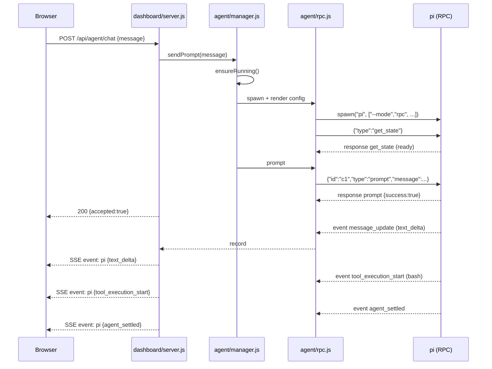
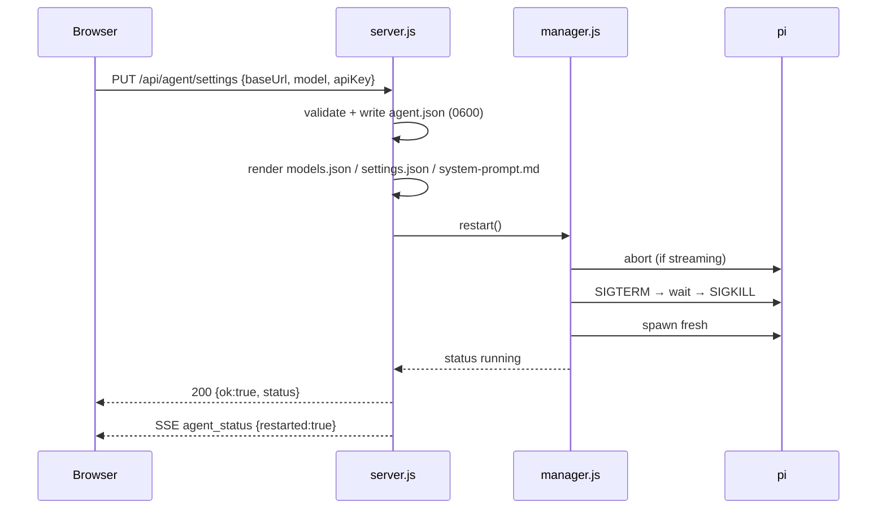

# 01 — Architecture

## 1. Component inventory

| Component | Type | New? | Responsibility |
|---|---|---|---|
| `dashboard/server.js` | Node HTTP server | changed | Existing site API **plus** agent routes |
| `dashboard/agent/config.js` | module | new | Read/write `agent.json`; generate `models.json` + system prompt |
| `dashboard/agent/rpc.js` | module | new | Spawn `pi --mode rpc`; JSONL framing; command correlation; event fan-out |
| `dashboard/agent/manager.js` | module | new | Own the agent lifecycle: start, restart, health, session list, single-turn lock |
| `dashboard/public/js/chat.js` | browser module | new | Mini-chat + full-page chat, shared stream, local state |
| `dashboard/public/index.html` | HTML | changed | Settings fields + chat mount points |
| `dashboard/public/js/main.js` | browser module | changed | Settings form wiring, chat bootstrap |
| `dashboard/public/css/style.css` | CSS | changed | Mini-chat + full-page + settings styles |
| `agent/system-prompt.md` | text | new | Doctrine (dissolved router) + dynamic placeholders |
| `agent/guide.md` | text | new | Human-readable guide shown in the UI |
| `agent/extensions/searxng-search.ts` | pi extension | new (ported) | Optional web search tool |
| `dashboard/data/agent.json` | runtime data | new | Secret + settings (gitignored) |
| `dashboard/data/pi-agent/` | runtime data | new | pi config dir: `models.json`, `settings.json`, `sessions/` |

## 2. Process model

```
┌──────────────────────────────────────────────────────────────────────┐
│ Container "sitebox" (node:22-bookworm-slim, network_mode: host)      │
│                                                                      │
│  PID 1  node dashboard/server.js   ── HTTP :4445                     │
│    │                                                                 │
│    ├── child  node sites/example-notes/server.js   :4451   (existing)│
│    ├── child  node sites/<id>/server.js            :45xx   (existing)│
│    └── child  pi --mode rpc                        (stdio)  (new)    │
│           stdin  ◀── JSONL commands  from rpc.js                     │
│           stdout ──▶ JSONL responses+events to rpc.js → SSE          │
│           stderr ──▶ captured into the agent log ring buffer         │
└──────────────────────────────────────────────────────────────────────┘
```

**Key properties**

- **One long-lived agent process.** Not one per message. Multi-turn chat, abort,
  and steering all require a persistent process. Session *switching* happens
  inside it via `switch_session`/`new_session`.
- **One active turn at a time.** The RPC protocol is single-conversation; the
  manager serializes prompts. A second message while streaming is offered to the
  UI as *steer* or *follow-up* (see §6).
- **The agent is a sibling of the site processes.** It does not run inside the
  dashboard's process, so an agent crash cannot take the dashboard down (G5).
- **The dashboard is the only client.** Exactly one `EventSource`-driven UI
  stream is assumed, but the fan-out supports many subscribers (see §5).

## 3. Data flow

### 3.1 Configure (settings save)

```
Browser ──PUT /api/agent/settings {baseUrl, model, apiKey}──▶ server.js
                                                               │
                          config.save() ──▶ dashboard/data/agent.json (0600)
                                          │
                                          ├─▶ pi-agent/models.json   (provider+key)
                                          ├─▶ pi-agent/settings.json (skills/extensions)
                                          └─▶ pi-agent/system-prompt.md (rendered)
                                                               │
                          manager.restart() ──▶ kill old pi, spawn new pi
                                                               │
Browser ◀──200 {ok, status}───────────────────────────────────┘
```

### 3.2 Chat turn

```
Browser ──POST /api/agent/chat {message}──▶ server.js
                                             │ manager.sendPrompt(message)
                                             ▼
                                    rpc.js writes: {"id":"c1","type":"prompt","message":...}
                                             ▼
                                          pi stdin
                                             │
                                          pi stdout
                                             ▼
   {"type":"message_update", assistantMessageEvent:{text_delta}} ─┐
   {"type":"tool_execution_start", toolName, args}                │ rpc.js parses each line
   {"type":"tool_execution_end", result, isError}                 │ and republishes
   {"type":"agent_settled"}                                       │
                                             ┌────────────────────┘
                                             ▼
                          SSE fan-out  event: pi  data: {...}
                                             ▼
Browser ◀── text deltas, tool cards, settle ──┘
```

### 3.3 Agent builds a site

The agent uses the **existing** dashboard API (documented in `sitebox-config`):

```
pi (bash tool) ──curl GET  /api/ports/check?port=45xx──▶ server.js
               ──curl POST /api/sites {...}────────────▶ server.js → sites.json
               ──curl POST /api/sites/<id>/start───────▶ server.js → spawn site
               ──curl GET  /api/sites/<id>/health──────▶ server.js
```

Because the agent is a **separate process**, these requests are handled normally
while the chat SSE stream stays open. There is no re-entrancy or deadlock.

## 4. Startup sequence

```
server.js boot
  ├─ load sites.json (existing)
  ├─ autoDetect sites (existing)
  ├─ agent/config.load()            → settings or defaults
  ├─ agent/manager.init()           → does NOT spawn yet (lazy)
  └─ listen :4445

First chat message OR explicit restart
  └─ manager.ensureRunning()
       ├─ config.renderAll()        → models.json, settings.json, system-prompt.md
       ├─ spawn("pi", [...args], { cwd:/app, env: {...} })
       ├─ attach stdout line splitter → rpc.js event bus
       ├─ attach stderr → agent log buffer
       └─ wait for readiness (first response to get_state, or timeout)
```

**Lazy start** avoids a failing agent process when no settings exist yet, and
keeps dashboard boot fast.

## 5. Event fan-out

`rpc.js` emits parsed records on an internal `EventEmitter`. The HTTP layer keeps a
`Set` of SSE subscribers. Every parsed record is written to each subscriber.

```
rpc.js  ──emit("record", rec)──▶ manager ──▶ sse.broadcast(rec)
```

Rules:

- **Backpressure.** If a subscriber's socket buffer is full, drop *streaming deltas*
  (safe to lose) but never drop `message_end`, `tool_execution_end`, or
  `agent_settled` (state-bearing). A small per-subscriber queue with a cap
  implements this. See [`05-backend-api.md`](./05-backend-api.md#sse-backpressure).
- **Replay.** A new subscriber receives a synthetic `agent_status` snapshot
  (running? streaming? session id? model?) followed by a rehydrated transcript from
  `get_messages` on demand, not from a replay buffer. This keeps memory bounded.
- **Reconnect.** The browser reconnects with `Last-Event-ID`; the server sends a
  fresh status snapshot rather than replaying deltas (the authoritative state comes
  from `get_messages`).

## 6. Concurrency and the turn lock

The RPC protocol allows exactly one active run. The manager tracks
`isStreaming` (from `get_state` + events) and decides what to do with a new message:

| State | `streamingBehavior` | Result |
|---|---|---|
| Idle | (none) | Normal `prompt` |
| Streaming | `"steer"` | Injected after current tool calls |
| Streaming | `"followUp"` | Queued until the run finishes |
| Streaming | absent | **Rejected** with 409 (the UI must choose) |

The UI defaults to **steer** when the operator types during a run, with a visible
"steering…" affordance. See [`06-frontend-ui.md`](./06-frontend-ui.md#send-modes).

## 7. State ownership

| State | Owner | Storage | Lifetime |
|---|---|---|---|
| Site registry | dashboard | `sites.json` | persistent |
| Agent settings + key | dashboard | `agent.json` | persistent |
| pi config (models, skills, prompt) | dashboard (generated) | `pi-agent/*` | regenerated on save |
| Conversation | pi | `pi-agent/sessions/*.jsonl` | persistent |
| Live process | manager | memory | until restart/kill |
| UI open/expanded/session | browser | `localStorage` | per browser |
| Live stream | rpc.js → SSE | memory | transient |

**Rule:** the dashboard never parses pi session JSONL for business logic. It may
*list* session files (id, mtime, size) and ask pi (`get_messages`, `get_state`)
for content. Session format is pi's contract, not ours.

## 8. Failure modes and recovery

| Failure | Detected by | Recovery |
|---|---|---|
| pi binary missing | spawn `error` | status `unavailable`; UI shows setup hint |
| Settings invalid (no key/model) | config validation | agent not started; settings UI shows the field |
| pi exits while idle | `exit` handler | status `stopped`; respawn on next message |
| pi exits mid-turn | `exit` handler | status `crashed`; SSE sends `agent_error`; next message respawns + reopens session |
| pi hangs (no output) | readiness/`agent_settled` timeout | restart after N seconds; surface `agent_timeout` |
| Model endpoint 401/404 | `message_end.stopReason = "error"` | show the provider error text in chat |
| Malformed JSON line on stdout | line parser | log + skip the line, never crash the reader |
| SSE client disconnects | `req.on("close")` | remove subscriber; keep pi running |

Respawn strategy: **on demand + exponential backoff** after repeated failures
(1s, 2s, 4s, capped 30s), with a manual "Restart agent" button. Full detail in
[`02-rpc-protocol.md`](./02-rpc-protocol.md#lifecycle--recovery).

## 9. Sequence diagrams

### 9.1 First successful turn



### 9.2 Settings change restarts the agent



## 10. Why not the alternatives (summary)

| Alternative | Why rejected |
|---|---|
| In-process SDK | Breaks zero-dependency; agent crash kills dashboard; CJS→ESM churn |
| `pi --mode json` per message | Cold start per message; no steer/abort; poor chat UX |
| `RpcClient` from SDK | Same dependency problem as SDK, only moved |
| One pi process per chat session | More memory, session switching duplicated; single operator needs one |
| Embedding in the browser | Impossible: needs a process with filesystem + bash |

Full reasoning in [`11-risks-and-decisions.md`](./11-risks-and-decisions.md).
